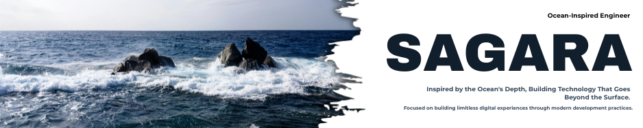

# Hi, I'm Untung Budiman! 👋
As a vocational high school graduate with a strong foundation in IT, I specialize in crafting web and mobile applications that push boundaries. My approach combines meticulous architecture with intuitive design — every pixel deliberate, every interaction meaningful.

This blend of technical depth and creative vision enables me to build digital experiences that don't just function — they resonate. From concept to deployment, I ensure each solution meets the highest standards of modern development.

## 📚 Learning & Knowledge

I'm currently learning **Actively seeking new professional opportunities and project collaborations. Leveraging current interim to continuously upgrade skills and deepen technical value, specifically in DevOps practices (Docker & Kubernetes) and modern development frameworks including Python, NestJS, and Vue to build scalable, production-ready applications.**

<h2 align="left">My Tools of the Trade.</h2>

  
  
  
  
  
  
  
  
  
  
  
  
  
  
  
  
  
  
  
  
  
  
  
  
  
  
  
  
  
  
  
  
  
  
  
  
  
  
  
  
  
  
  
  
  
  
  

## Contact & Links

- 📫 How to reach me **untgbdmnio@gmail.com**
- 👨‍💻 All of my projects are available at [https://www.sagaradev.digital](https://www.sagaradev.digital)

## Connect with Me

&nbsp;&nbsp;&nbsp;
&nbsp;&nbsp;&nbsp;
&nbsp;&nbsp;&nbsp;
&nbsp;&nbsp;&nbsp;

## Support Me

 
 

